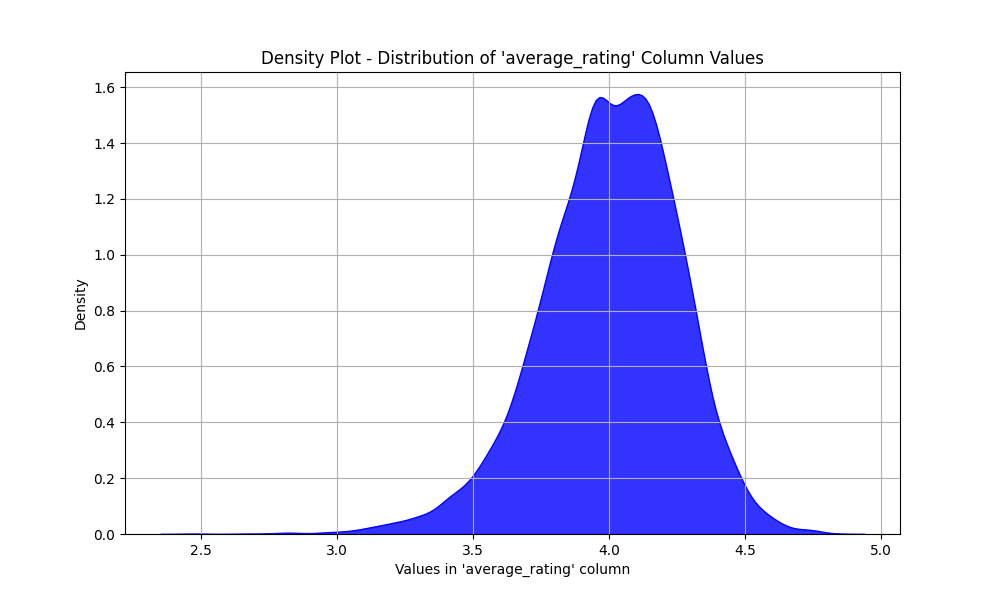
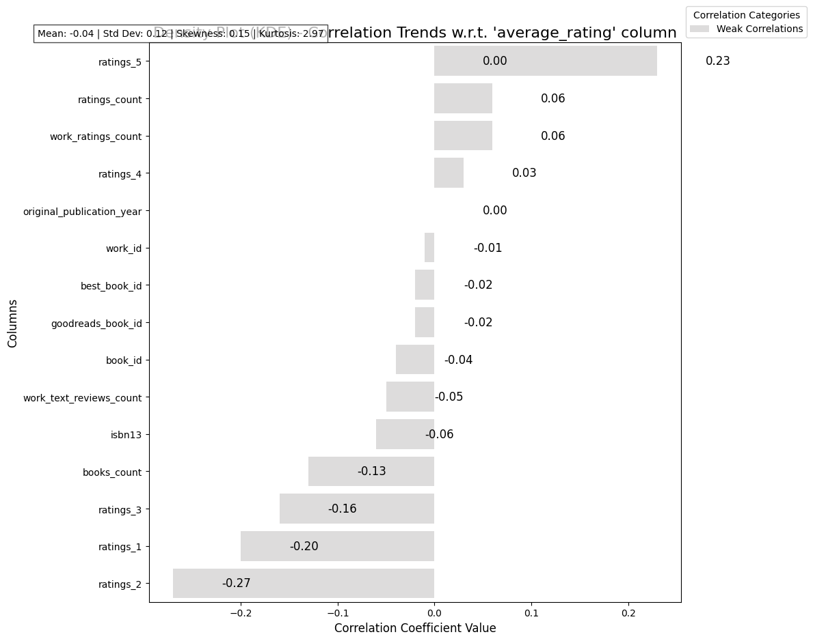

```markdown
# Chapter One: The Beginning
## Mysterious Mr. Dataset

In the vast realm of literature, the dataset labeled *goodreads.csv* emerges as a treasure trove of insights encapsulating the diverse world of books. Comprising **10,000 rows** and **23 columns**, this complex dataset provides a detailed overview of various books listed on Goodreads, a prominent platform for readers and authors alike.

### Key Features:
- **Numerical Columns**: Includes identifiers and metrics such as `book_id`, `average_rating`, `ratings_count`, and detailed rating distributions (`ratings_1` through `ratings_5`).
- **Categorical Columns**: Features essential descriptive attributes like `authors`, `original_title`, and `language_code`.
- **Missing Values**: Key columns such as `isbn` (7.0%), `original_title` (6.0%), and `language_code` (11.0%) reveal gaps that may influence analysis.
- **Central Column**: The `average_rating` serves as a crucial metric, offering an intriguing look into reader perceptions and preferences.

As we delve deeper, we aim to unravel the myriad connections within this dataset, unlocking stories that lie hidden beneath the data points.

# Chapter Two: The Plot Thickens
## Detective Mr. Analyst

To analyze this captivating dataset, several steps were undertaken akin to a detective piecing together clues. 

1. **Data Preprocessing**:
    - **Handling Missing Values**: Evaluating the extent of missing data informed decisions regarding imputation or exclusion, ensuring that the analysis remained robust.
    - **Data Types Confirmation**: Validating numerical and categorical types allowed for appropriate analytical methods to be employed.

2. **Exploratory Data Analysis (EDA)**:
    - **Statistical Summary**: Generated descriptive statistics to understand the distribution and central tendencies of metrics such as `average_rating`.
    - **Visualizations**: Crafted density plots (KDE) to reveal the distribution of `average_rating` (See Figure 1).

3. **Correlation Analysis**:
    - The method of correlation analysis was chosen to determine relationships between the `average_rating` and the other numerical metrics, understanding how different ratings connect.

This methodical approach was critical, ensuring that our findings would be grounded in analytical rigor and empirical truth.

# Chapter Three: The Revelation
## Omnipotent Patterns

As insights started to unfurl, certain patterns emerged with clarity and distinction. The data spoke, revealing trends that delineate the narrative of readers’ preferences and behaviors.

### Key Findings:
- **Distribution of Average Ratings**: The density plot indicates a peak around an average rating of **4.0** with the following descriptive statistics:
  - **Mean**: 4.0
  - **Median**: 4.02
  - **Standard Deviation**: 0.254
  - Skewness: -0.512, suggesting a slight leftward tail.
  - **Quantiles**: 25th percentile at 3.85, 50th at 4.02, and 75th at 4.18.
  
- **Correlation Insights**: Analysis of correlations with the `average_rating` revealed:
  - **Weak Positive and Negative Correlations**: Most noteworthy were:
    - `ratings_5`: 0.23 (Weak Positive)
    - `ratings_1`: -0.20 (Weak Negative)
    - The mean correlation across metrics was -0.04, suggesting a lack of strong connections overall.
  
This complex interplay of ratings illustrates how readers assess books. The slant towards higher ratings indicates a generally favorable reception among Goodreads users.

# Chapter Four: The Deed That Must Be Done
## The Act

With the insights drawn from this rich dataset, several actionable recommendations arise, enhancing understanding and potentially guiding future improvements in user engagement and content curation.

### Recommendations:
1. **Focus on High-Rated Books**: Books with higher `average_rating` should be highlighted in marketing campaigns, leveraging the existing favorable perception.
2. **Investigate the Lower Ratings**: A deeper investigation into books with significant lower ratings could unveil specific themes or author practices that might require attention.
3. **Engagement Strategies**: Implement strategies to increase reader engagement, such as incentivized reviews or highlighting reader discussions, particularly for books with a strong contingent of low ratings.
4. **Data Enrichment**: Address the missing values in key categorical columns to improve overall data quality, potentially leading to even richer insights.

As the story of Mr. Dataset continues to unfold, the methodology employed and the insights unearthed provide a clarion call for action within the literary community. This narrative serves not merely as an exploration of data but as a foundational step in enhancing the reader’s experience across the literary landscape.
```
# Data Visualizations
### **Figure 1 : Density Plot - Distribution of 'average_rating' Column Values**



### **Figure 2 : Horizontal Bar Plot - Correlation Analysis w.r.t. 'average_rating' column**



