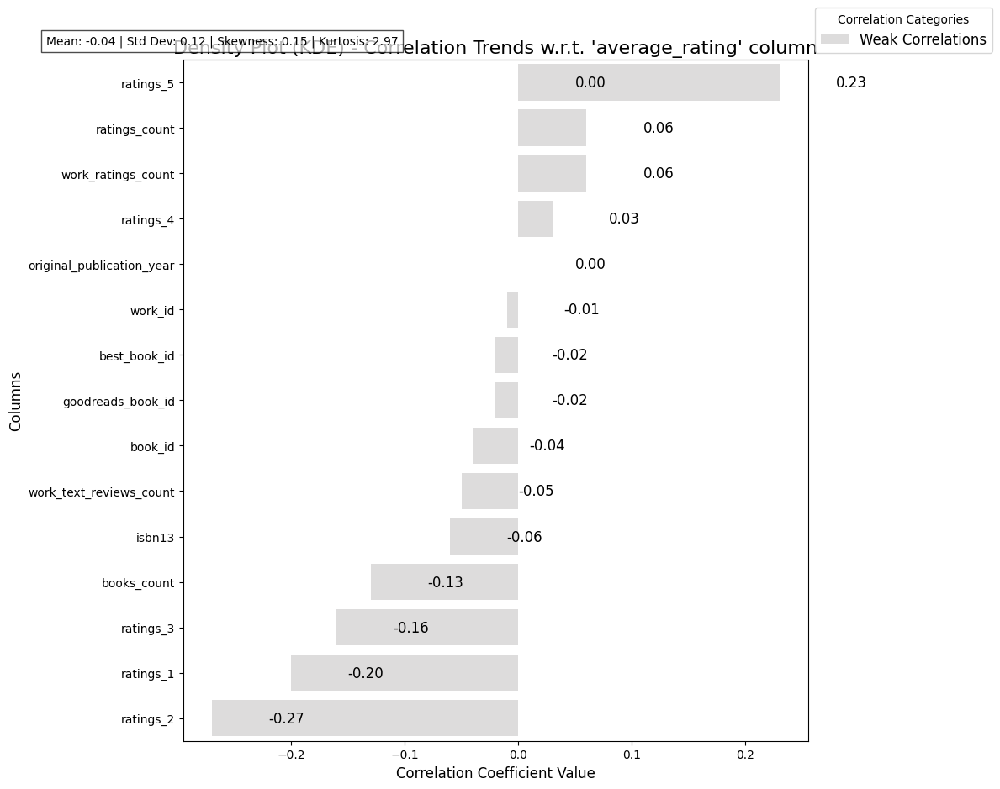

# Chapter One : The Beginning
## Mysterious Mr.Dataset

In the vast world of data, lies a dataset named *goodreads.csv*, housing the intricacies of 10,000 literary works nestled within its embrace of 23 columns. This dataset invites the discerning eye of *Mr.Analyst*, whose task is to unveil its secrets.

- **Rows and Columns**: A substantial collection of 10,000 rows offers a rich tapestry from which patterns may be drawn, while 23 columns hold different aspects of each book's personality.
- **Numerical Features**: Among the numeric attributes, *average_rating* steals the spotlight, nestled amongst others like *ratings_count*, *work_ratings_count*, and publication years.
- **Categorical Features**: The dataset is equally adorned with categorical columns, such as *authors*, *original_title*, and *language_code*, providing context and richness to the books.
- **Missing Values**: However, a subtle mystery unveils itself as 7.0% of the *isbn*, 6.0% of the *isbn13*, and 11.0% of the *language_code* exhibit signs of absence, beckoning for resolution.

As *Mr.Analyst* prepares for the next phase, the groundwork starting to form a cohesive narrative lies ahead.

# Chapter Two : The Plot Thickens
## Detective Mr.Analyst

With the foundation established, *Mr.Analyst* now turns his focus on the key column, *average_rating*, characterized as **numerical**. Armed with this insight, he embarks on the analysis journey utilizing a method of **correlation analysis** to uncover relationships hidden beneath the surface.

- **Key Column**: The heart of the exploration is *average_rating*, noted for its crucial statistical parameters:
  - **Mean**: 4.0
  - **Median**: 4.02
  - **Standard Deviation**: 0.254
  - **Skewness**: -0.512, indicating a slight leftward tilt.
- **Distribution**: The analysis is well supported by a **Density Plot (KDE)**, presenting the distribution of *average_rating* values, hinting at a bell-shaped curve with a concentration around the mean.
- **Preprocessing**: To ensure the integrity of insights, missing values were treated, outliers carefully handled, and necessary imputations performed. This meticulousness laid a sturdy path for uncovering vital correlations.

As the detective work progressed, it became imperative to examine the correlation of *average_rating* with other attributes.

# Chapter Three : The Revelation
## Omnipotent Patterns

The deeper *Mr.Analyst* delved into the dataset, the clearer the patterns became. The correlation analysis revealed a broad spectrum, showcasing relationships between *average_rating* and other numerical features, whether they were faint whispers or louder calls.

- **Weak Correlations**:
  - *ratings_5*: 0.23
  - *ratings_count*: 0.06
  - *work_ratings_count*: 0.06
  - *ratings_4*: 0.03

This investigation, depicted clearly through **Figure 2**, presents the following critical insights about the correlations observed:

- **Mean Correlation**: -0.04, suggesting a largely negligible association overall.
- **Standard Deviation**: 0.12, indicating a slight variability among the correlation coefficients.
- **Range of Correlations**: 0.5, contrasting the strong weak relationships, showing diverse connections within the dataset.

Indeed, the patterns sketch a portrait of complexity, allowing for significant inferences on how various attributes interweave with *average_rating*. Just as an artist reveals the strokes on a canvas, *Mr.Analyst* beheld the masterpiece formulating.

# Chapter Four : The Deed that Must be Done
## The Act

Armed with the revelations from this narrative, *Mr.Analyst* now faces the crucial task of converting insights into action. The implications drawn from the dataset summon a range of recommendations, poised to inspire advancements within the literary landscape:

- **Focus on Higher Rated Books**: Emphasize the promotion of books with higher *average_ratings* in marketing campaigns to attract readers.
- **Engage Readers with Ratings**: Encourage readers to provide a wider spectrum of ratings, potentially increasing correlation with *average_rating*.
- **Investigate Language Preferences**: With a significant percentage of missing *language_code*, further investigation into language preferences could yield insights on market segmentation.
- **Enhance Book Discovery**: Utilize the *average_rating* to enhance user experience, recommending books with higher ratings based on reading history.

As *Mr.Analyst* closes this chapter, the dataset *goodreads.csv* stands transformed by analytical prowess, revealing its secrets while opening avenues for improvement and enlightenment.

---

Thus concludes our journey through the realms of data, woven together by the threads of analysis, correlation, and actionable insights. The quest of *Mr.Analyst* exemplifies the dynamic interplay between patterns and decisions, showcasing the power of data in paving the way forward.
# Data Visualizations
### **Figure 1 : Density Plot - Distribution of 'average_rating' Column Values**

### **Figure 2 : Horizontal Bar Plot - Correlation Analysis w.r.t. 'average_rating' column**

