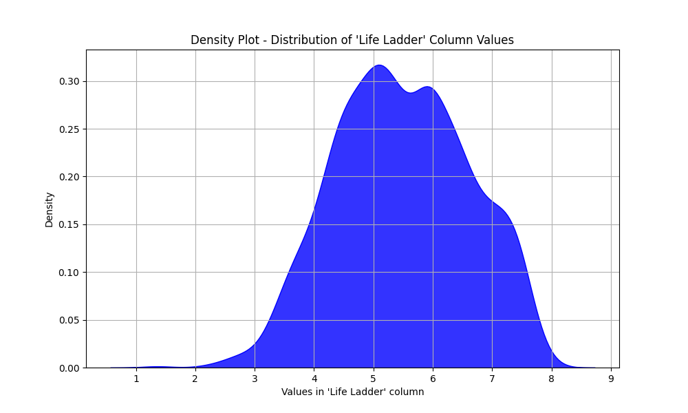
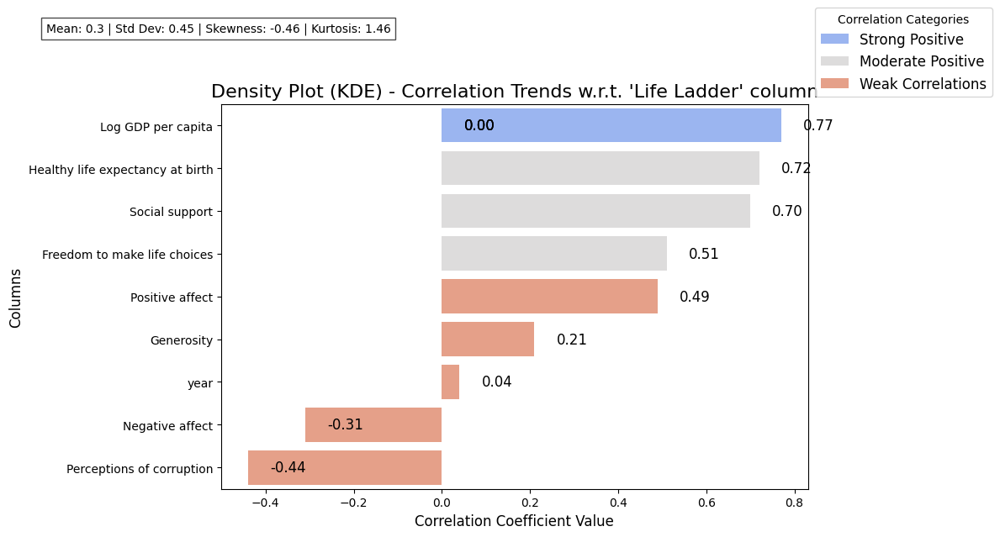

# Chapter One : The Beginning
## Mysterious Mr.Dataset

In a realm of numbers and insights, *Mr.Dataset* emerged - a collection of **2,363 rows** and **11 columns**. This entity held secrets waiting to be unveiled. As I delved deeper into its features, I observed the following key elements:

- **Numeric Columns**:
    - Year
    - Life Ladder
    - Log GDP per capita
    - Social support
    - Healthy life expectancy at birth
    - Freedom to make life choices
    - Generosity
    - Perceptions of corruption
    - Positive affect
    - Negative affect

- **Categorical Columns**:
    - Country name

One notable observation was the **percentage of missing values** across various columns, hinting at the need for careful attention during analysis:
- Log GDP per capita: 1.0%
- Social support: 1.0%
- Healthy life expectancy at birth: 3.0%
- Freedom to make life choices: 2.0%
- Generosity: 3.0%
- Perceptions of corruption: 5.0%
- Positive affect: 1.0%
- Negative affect: 1.0%

The dataset also revealed that the column 'year' bore less than **20 unique values**, leading to questions about the temporal dynamics within this data trove. 

# Chapter Two : The Plot Thickens
## Detective Mr.Analyst

With the stage set, it was time for *Mr.Analyst* to investigate the mysteries held within *Mr.Dataset*. I decided to focus on the key column, **Life Ladder**, which we found to be **numerical**. To bring clarity to the relationships hidden in this data, I employed **correlation analysis**, seeking to understand how various elements were interlinked.

Before diving into the heart of analysis, several **preprocessing steps** were essential:
- **Handled Missing Values**: I applied imputation techniques to minimize data loss.
- **Outlier Detection**: Outliers were examined to ensure they did not skew the results.
- **Validation of Data Normality**: Conducted tests on the distribution to confirm adherence to normality.

Equipped with a strong methodological foundation, I was ready to reveal the intricate connections surrounding the Life Ladder.

# Chapter Three : The Revelation
## Omnipotent Patterns

As I analyzed the *Life Ladder*, the findings began to illuminate patterns of significance:

- The **mean** value of the Life Ladder was calculated to be **5.48**, with a **median** of **5.45** and a **standard deviation** of **1.126**.
- The distribution appeared nearly **normal**, with skewness at **-0.054** and kurtosis at **-0.562**, suggesting a balanced structure with slight tails.

Among the correlations concerning the **Life Ladder**, several relationships stood out dramatically:

- **Strong Positive Correlation**:
  - Log GDP per capita: **0.77** 

- **Moderate Positive Correlations**:
  - Healthy life expectancy at birth: **0.72**
  - Social support: **0.70**
  - Freedom to make life choices: **0.51** 

- **Weak Correlations**:
  - Positive affect: **0.49**
  - Generosity: **0.21**
  - Year: **0.04**
  - Negative affect: **-0.31**
  - Perceptions of corruption: **-0.44**

These revelations illustrated how economic and social factors intertwine with the overall life satisfaction represented by the **Life Ladder**. 

As shown below in **Figure 1**, the **Density Plot** of the Life Ladder's distribution encapsulates these insights well. 

A further exploration through **Figure 2**, which is a **Horizontal Bar Plot**, highlights the correlation dynamics surrounding the Life Ladder.

# Chapter Four : The Deed that Must be Done
## The Act

Having unraveled the patterns within the dataset, the focus now shifts to actionable insights. These findings could shape future initiatives aimed at enhancing the well-being of individuals within various contexts. Here are the recommended actions based on the insights derived:

- **Enhance Economic Policies**: Given the strong correlation with GDP per capita, policymakers should focus on creating economic environments that promote higher GDP growth, directly impacting life satisfaction levels.
  
- **Promote Healthy Lifestyles**: Health programs need to be reinforced, given the substantial link between healthy life expectancy and life satisfaction. Initiatives that boost healthcare access can create ripples of positive outcomes.

- **Expanding Social Support Networks**: The correlation with social support indicates that communities should foster environments that nurture interpersonal connections and communal support.

- **Prioritize Freedom and Choice**: Strategies to ensure communities have access to freedom in making life choices could enhance life satisfaction.

- **Monitor Corruption Perceptions**: Since perceptions of corruption negatively correlate with life ladder scores, stakeholder engagement and transparency initiatives should be amplified in governance.

In conclusion, by strategically addressing these areas, we can empower individuals to lead richer, more fulfilling lives. The journey through *Mr.Dataset* has offered insights that pave a path towards actionable transformation.
# Data Visualizations
### **Figure 1 : Density Plot - Distribution of 'Life Ladder' Column Values**

### **Figure 2 : Horizontal Bar Plot - Correlation Analysis w.r.t. 'Life Ladder' column**

