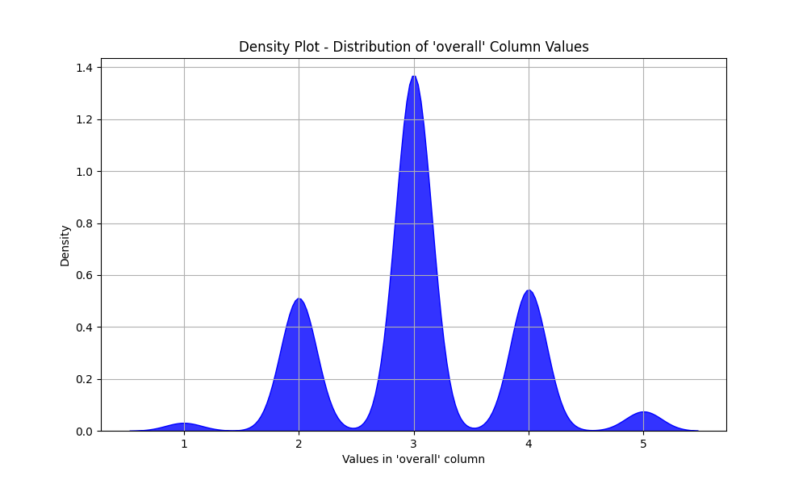
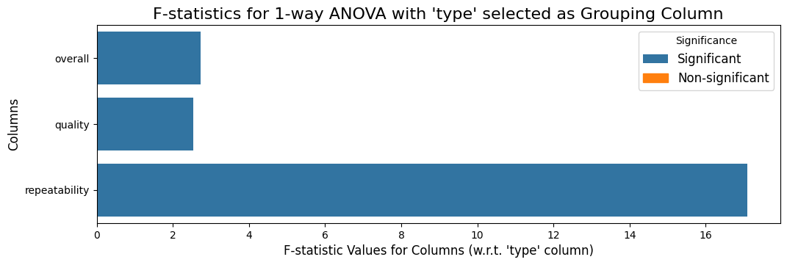

```markdown
# Chapter One: The Beginning

## Mysterious Mr. Dataset

In the diverse realm of digital media, a dataset silently awaited scrutiny, holding secrets within its 2652 rows and 8 columns. This dataset, `media.csv`, embodies a multifaceted structure, merging both numeric and categorical elements, thus presenting a rich tapestry for exploration.

- **Structure**: 2652 records, 8 attributes
- **Numeric Columns**: `overall`, `quality`, `repeatability`
- **Categorical Columns**: `date`, `language`, `type`, `title`, `by`
- **Missing Values**: 
  - `date`: 4.0%
  - `by`: 10.0%
- **Unique Values Insight**: 
  - `language`: 11 different languages
  - `type`: 8 distinct media types
  - `overall`: Ratings from 1 to 5
  - `quality`: Ratings from 1 to 5
  - `repeatability`: Ratings from 1 to 3

This dataset shines a light on the intricate relationships among varying media types, their reception, and viewers' experiences, inviting an analytical journey.

# Chapter Two: The Plot Thickens

## Detective Mr. Analyst

To unveil the narratives held within `media.csv`, a methodical approach was employed. The analysis began with meticulous preprocessing to tackle missing values, ensuring accurate and actionable insights could emerge. 

- **Preprocessing Steps**: 
  - Addressed missing values, particularly in the `date` and `by` columns, upholding data integrity.
- **Analytical Techniques**: 
  - Employed **1-Way ANOVA** to discern how the media `type` influences the ratings across `overall`, `quality`, and `repeatability`.
  - Explored correlations with categorical features to establish significant findings.

This systematic groundwork laid the foundation for informed conclusions, guiding the narrative through analytical rigor.

# Chapter Three: The Revelation

## Omnipotent Patterns

Upon thorough analysis, enlightening patterns emerged, revealing the influence of media types on viewer ratings. The insights gleaned from the data reveal an intricate dance of preferences and perceptions, showcasing significant trends.

- **Key Patterns**:
  - The distribution of media types indicated a predominant interest in **movies**, comprising 2211 entries, significantly overshadowing other formats (See Figure 1).
  - **ANOVA Results** highlighted:
    - Significant differences in `overall` ratings (F-statistic: 2.72, p-value: 0.008195)
    - Noteworthy differences in `quality` ratings (F-statistic: 2.54, p-value: 0.01319)
    - Extremely significant variations in `repeatability` ratings (F-statistic: 17.1, p-value: 0.0)
- **Visual Insights**: The horizontal bar plot (See Figure 2) vividly illustrates the disparities in ratings across media types, reinforcing these observations.

These revelations not only illuminate user preferences but also suggest directions for crafting content that resonates with audiences.

# Chapter Four: The Deed That Must Be Done

## The Act

The insights uncovered call for decisive actions to harness the potential of the dataset and reinforce content strategies.

- **Actionable Recommendations**:
  - Focus on **enhancing movie production**, as this medium garners the highest viewer engagement and ratings.
  - **Investigate** the drivers of high repeatability ratings, particularly in certain types, to further enrich user engagement and loyalty.
  - **Explore** the impact of language on viewer ratings, especially for the lesser-represented languages, to broaden reach and inclusivity.
  - **Conduct further analysis** on the non-significant columns, as emerging trends today may carry predictive value for future media consumption patterns.

In conclusion, `media.csv` serves as a treasure trove of insights, beckoning stakeholders to act on the revelations within. By adopting these recommendations, content creators and strategists can navigate the evolving landscape of media with confidence and foresight.
```
# Data Visualizations
### **Figure 1 : Frequency Count Bar Chart - Frequency Count of 'type' Column**



### **Figure 2: Horizontal Bar Plot - 1-Way ANOVA Analysis w.r.t. 'type' column**



