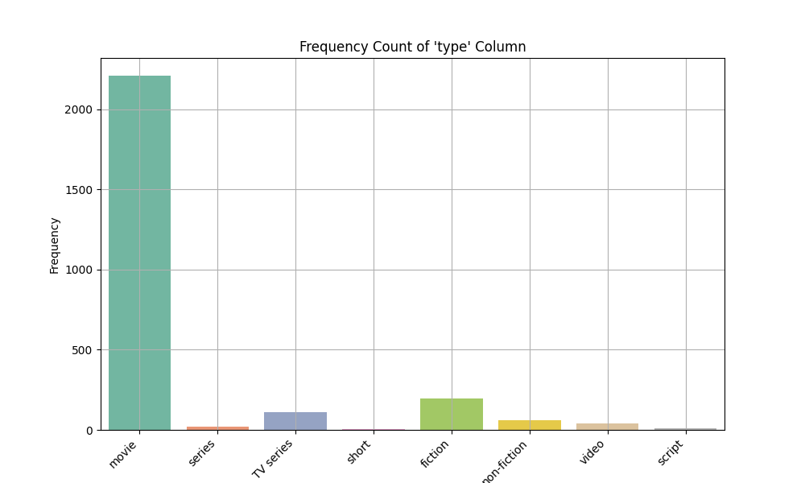

# Media Analysis Report

## Introduction

In this report, we explore a dataset containing various media-related variables that allow us to analyze how different factors correlate with the overall ratings of media items. The primary goal is to uncover relationships that could enhance our understanding and strategy within media production, marketing, and consumption.

## Dataset Overview

- **Filename**: 'media.csv'

## Data Visualizations
### **Figure 1**

### **Figure 2**

